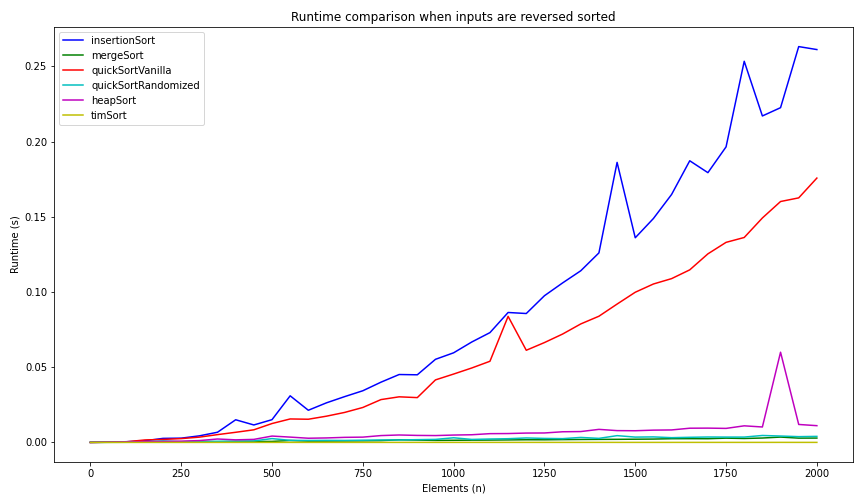
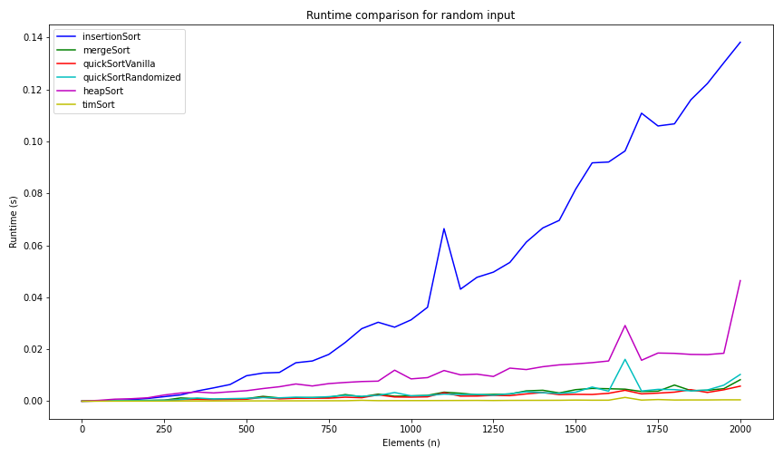
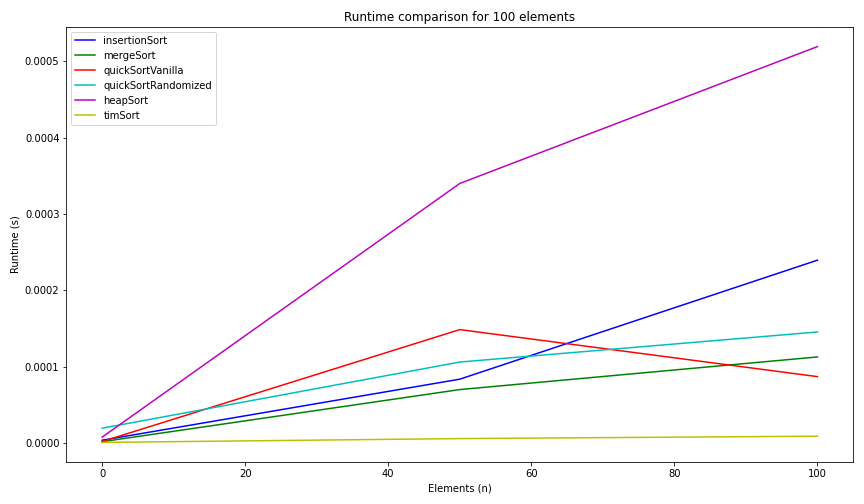
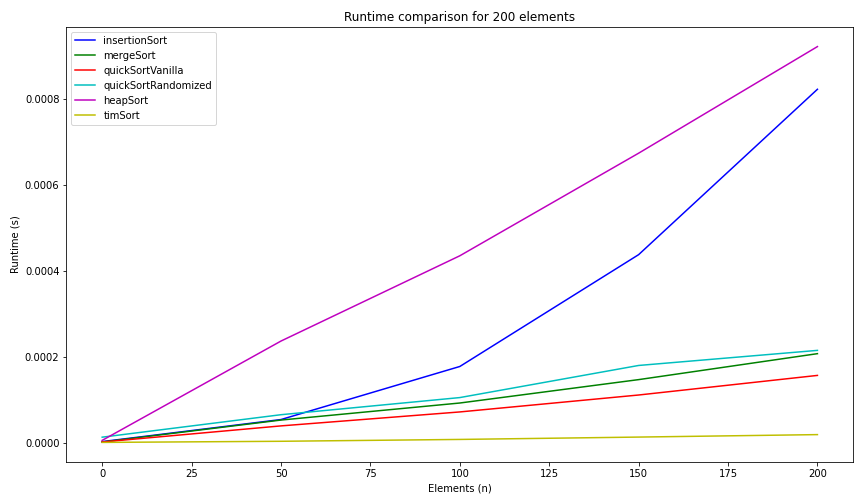
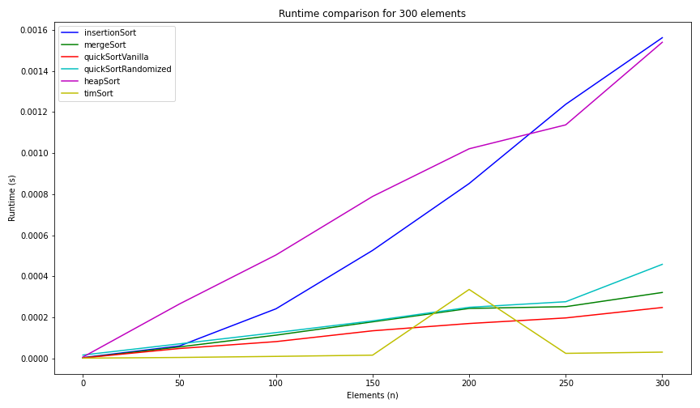
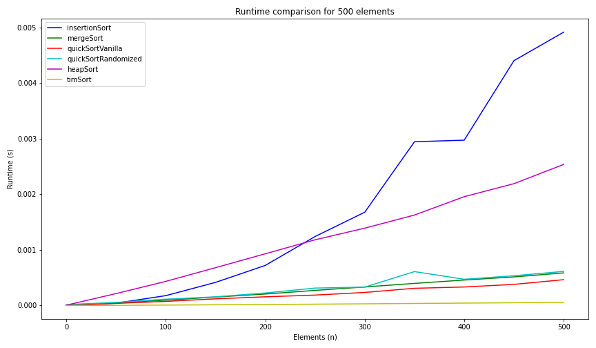

# Sorting Algorithms Comparison

## Introduction

I implemented *insertion sort*, *merge sort*, two variants of 
*quick sort*, and *heap sort*. I then compared the runtime of different sorting
algorithms.

I also included Python's default sorting implementation - Tim sort - for
comparison. 

## Algorithm Overview

**Insertion sort**: 
* Best case - $O(n)$
* Worst case - $O(n^2)$
* Average case - $O(n^2)$
* Additional space complexity - $O(1)$ 
* Input sensitive: &#x2713;
* In-place: &#x2713;
* Stable: &#x2713;

**Merge sort**:
* Best case - $O(nlog(n))$ 
* Worst case - $O(nlog(n))$
* Average case - $O(nlog(n))$ 
* Additional space - $O(n)$
* Input sensitive: &#x2717;
* In-place: &#x2717;
* Stable: &#x2713;

**Quick sort**:
* Best case - $O(nlog(n))$
* Worst case - $O(n^2)$
* Expected case - $O(nlog(n))$
* Additional space - $O(1)$ 
* Input sensitive: &#x2717;
* In-place: &#x2713;
* Stable: &#x2717;

**Heap sort**:
* Best case - $O(nlog(n))$
* Worst case - $O(nlog(n))$
* Average case - $O(nlog(n))$
* Additional space - $O(1)$ 
* Input sensitive: &#x2717;
* In-place: &#x2713;
* Stable: &#x2717;

## Setup 

Create a virtual environment: `python3 -m venv env`

Activate virtual environment: `source env/bin/activate`

Install pre-requisites: `pip install -r requirements.txt`

Add permision to file: `chmod +x comparison.py`

Execute program: `./comparison.py`

## Code / Test

In this project, my main driver is written in **comparison.py** and the 
sorting algorithms are implemented in **sorting.py**. 

**comparison.py** executes the sorting algorithms on a given input and keep
tracks of the runtime. To calculate the runtime, I created a decorator. When
an algorithm is called, the initial time is recorded. After the algorithm has 
finished executing, the final time is recorded. The difference in final and 
initial time is the runtime of the algorithm. 

Nested inside the decorator is also an assertion that the output of my 
implementations need to equal the output of the default sorting function in 
Python. 

For all sorting algorithms, I considered 3 different type of test cases - 
*sorted input*, *reverse sorted input*, and *randomly generated input*. The 
first two cases can be generated using Python's `range(n)` and 
`reversed(range(n))`, respectively. The final test case was generated using 
**numpy** (np), `list(np.random.randint(lower bound, upper bound, number of 
elements)`. For reproducible results, I set the seed to 42. In the randomly 
generated input test, I ran a loop to generate a set of 0 to 999 elements. 
This also made sure that even and odd cardinality inputs are thoroughly tested. 

**sorting.py** implements *insertion sort*, *merge sort*, *quick sort*, and
*heap sort*. 

1) Insertion sort - The invariant of this algorithm ensures that at any index
during sorting, the values at previous indices must be sorted. While 
implementing insertion sort, at every index, I extracted the values of 
previous indices into a list and assert that Python default sort also 
produces the same output.
2) Merge sort - Merge sort subdivides the array and sorts the subarrays. I 
tested the algorithm on small inputs first to make sure my indices are
correct (by printing) during the merge operation. 
3) Quick sort - I implemented default quick sort and randomized quick sort. For
the default version, I used the rightmost element of the subarray as the pivot.
I implemented the randomized version when I have ensured that the default 
version works correctly. For randomized quicksort, I precomuted a list 
of random indices (0 to the length of the array) with the same size as the 
array. Then, quicksort is executed by passing in the list of indices as pivot.
4) Min heap - I first implemented building a heap. For the heap, I transformed
the input set so that every element is shifted by one index (the 0-th index
stores `None`). This simplified the math operations during `heapify`. For 
heapifying, I used recursion. There are three base cases to consider. First,
the current index is out of range in the heap; in this case, the function 
returns. Second, if the children do not exist; in this case, I set the 
children's value to `np.Inf` (positive infinity). This assumes that the 
elements in the input set are finite numbers. Third, if both children are 
larger, the recursion stops. The recursive case is on the smaller of the two 
children. I used small inputs to test if the heap has been built correctly by 
drawing out the tree representation of the output. Heap sort correctness used 
test cases as described above. 

Finally, **comparison.py** has a method to receive inputs and run all 
the algorithms implemented and plot graphs. The graphs are displayed in 
a Jupyter notebook. By providing a value to `output` in `__init__` method and
`figitle` in `__call__`, you can also save the output graph!

## Analysis

### Sorted Input

For this test, I ran a for loop to create inputs of 0 to 2000 elements in 
sorted order, incremented by 50 each time. 

As expected, the traditional implementation of *quick sort* has the longest 
runtime as input size grows. This is because the pivot (in my implementation) 
is always the greatest element in the subarray for a sorted input.
In fact, increasing the number of elements to around 3000 will raise a 
`maximum recursion depth` runtime error. The runtime for *quick sort* in this 
case is $O(n^2)$. 

The fastest algorithm is *Tim sort*, which is a combination of insertion
sort and merge sort. The second fastest algorithm is *insertion sort*, which
is barely seen above the plotted line for *Tim sort* (zoom in for a better 
view). This is because insertion sort is input sensitive, so given a sorted 
input, it does minimal work. 

*Merge sort*, *heapsort*, and *randomized quick sort* all have neligible differences
in runtime. It is worth noting that in the worst case, randomized quick sort
can perform as badly as traditional quick sort; however, with the current
seed that I set, this was not the case. Heap sort has a slightly longer 
runtime because of the overhead to set up the heap. These 3 sorting algorithms
are input insensitive - their time complexity is $O(nlog(n))$ (expected 
for randomized quick sort).

### Reversed Sorted Input

For this test, I ran a for loop to create inputs of 0 to 2000 elements in 
reversed sorted order, incremented by 50 each time. 

The two most noticeable lines are that of *insertion sort* and *traditional
quick sort*. For *insertion sort*, at every index, the algorithm has to traverse
to start of the array. The time complexity is $O(n^2)$. For *quick sort*,
the pivot is always the smallest in the array so only 1 inversion is corrected
after every partition. The time complexity is $O(n^2)$. However, I expected
both these algorithms runtime to be somewhat similar, but there's a noticeable
gap as the input size grows larger. 

The runtime between *Tim sort*, *merge sort*, *heap sort*, and *randomized 
quick sort* is neglible. The trend is very smilar to the graph for sorted
input. However, there was a peak between the mark for 1750 to 2000 elements
for *heap sort*; but I'm not sure what causes this.

### Heap Sort Comparison

After I have finished the sorted and reversed sorted case, it was interesting
to see the runtime for heap sort on a sorted array and that of a reversed
sorted array. 

For a min heap, having an already sorted input means that there will be less
overhead work when building the heap. I tested this hypothesis by generating 
an sorted input set and a reversed sorted input set from 0 to 10000 elements
to compare. 

From the graph, the runtime on the sorted data is smaller than that of the 
reversed sorted data. As the input size grows, it seems like the gap in 
the runtime also grows. 

### Random Input

For this test, I ran a for loop to generate inputs of 0 to 20000 elements 
randomly using **numpy**. 

*Insertion sort* has an expected run time of $O(n^2)$. In this test, its
runtime is much more significant compared to other sorting algorithms.

In this test case, *traditional quick sort* and *randomized quick sort* have
very similar runtime. However, it is worth noting that at the mark between 
1500 and 1750 elements, there was a peak in runtime for *randomized quick sort* 
(also for heap sort). Therefore, we can see that *randomized quick sort* 
helps to optimize runtime for inputs that are sorted or reversed sorted. But
if the distribution of the data is completely random, *traditional quick 
sort* is a good choice. However, this can be a biased statement because
the generated input sets and random indices were pre-determined by the seed.

### Small Dataset

In this section, I analyzed the time complexity of the sorting algorithms 
on small input sizes.

<figure>
	
</figure>

<figure>
	
</figure>

<figure>
	
</figure>

<figure>
	
</figure>

<figure>
	
</figure>

Consistently for these tests, *heap sort* has the worst runtime. Therefore,
it should be not be used on a small dataset size. 

We see that *traditional quick sort* has the faster runtime than
*randomized quick sort* - which supports the conclusion I've reached in 
the previous section.

*Traditional quick sort* also outperforms *merge sort* by a narrow margin. 
Therefore, *traditional quick sort* is a good choice for small datasets. 

## Takeaways 

1) I learned that iterables are passed by reference.
2) I learned to precompute the random indices to optimize randomized quick sort
(shoutout to Peak!). 
3) Differences in sorting algorithms (described in the previous section).
